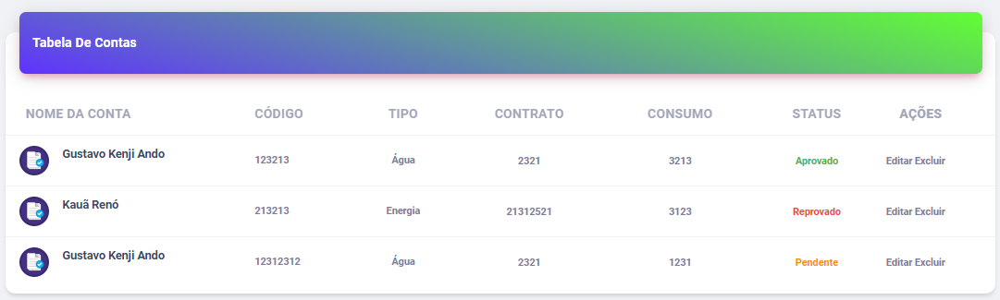
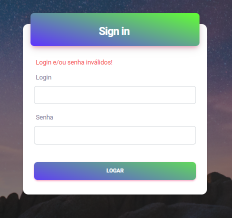
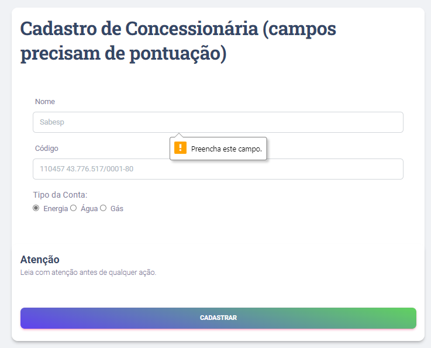

# Heurísticas aplicadas no API
Aqui será colocado a aplicação das heurísticas no API para melhor experiência ao cliente.

## Predictable 

### Cores intuitivas (Aprovado, reprovado e pendente):
A cor verde para aprovado, vermelha para reprovado e amarela para pendente torna o sistema mais previsível e intuitiva pelo usuário.

## Input Assistance

### Login ou senha inválida:
Ao usuário tentar entrar na sua conta com login ou senha incorreta, uma mensagem de erro informando-o é apresentado.

## Campo de cadastro:
Quando o usuário enviar um formulário com um campo obrigatório vazio, é solicitado que ele preencha o campo.

