# Avaliação das Heurísticas 

De acordo com [WCAG/W3C](https://www.w3.org/WAI/WCAG21/quickref/), será apresentado neste texto, exemplos e contraexemplos sobre a aplicação de alguns tópicos das heurísticas apresentadas neste site.
***
## 1 Perceivable

### 1.1 Text alternatives

Nesta heurística, indica-se uma forma alternativa de texto para conteúdo que não é de texto.

#### Exemplo:
Esta heurística está presente em sites que possuem o parâmentro alt na tag  para adicionar uma imagem. Deste modo, com esse parâmetro na tag é possível adicionar um texto como descrição da imagem para ser mostrada caso algum problema ocorra e não seja possível utilizar a imagem, ou então até mesmo, muito útil, para cegos. O exemplo que escolhi está presente no site de notícias da *Estadão* como podemos ver abaixo:

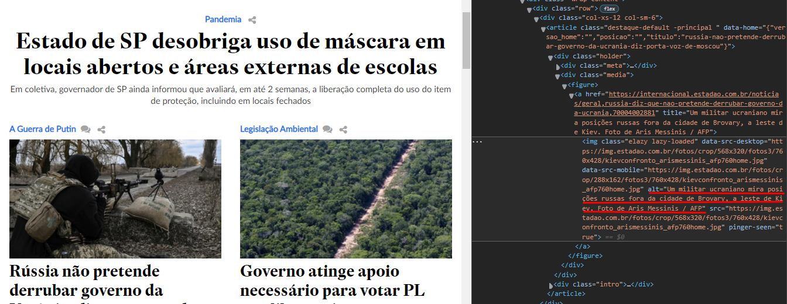

#### Contraexemplo:
Como contraexemplo, nós não encontramos nenhuma descrição de imagem no parâmentro alt:

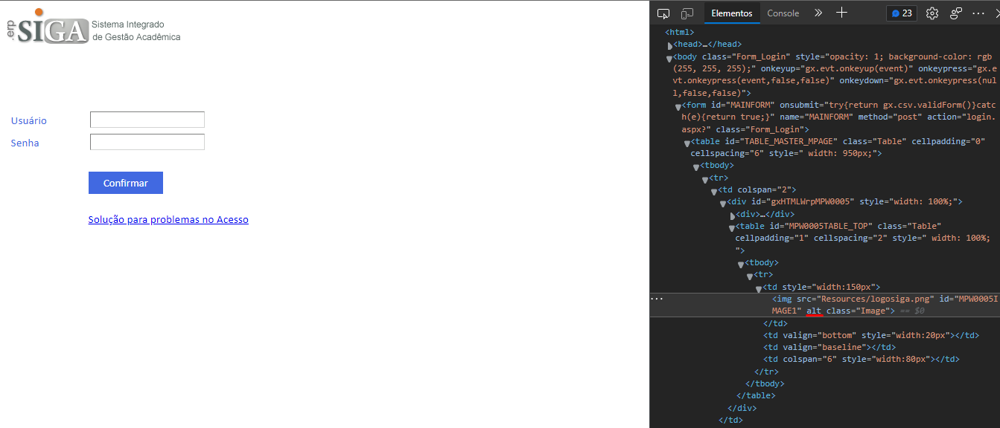

### 1.2 Time-based Media

Aqui, é esperado que possua outra alternativa para vídeos e áudios.

#### Contraexemplo:
Os vídeos que aparecem no site da G1 não são apresentados em outras alternativas:

### 1.3 Adaptable

Para melhor experiência de todos, o ideal é que seu site ou software seja adaptável para maior número de plataformas possíveis

#### Exemplo:
A amazon, por exemplo, possuí seu site totalmente adaptável tanto para computadores quanto para dispositivos móveis:

#### Imagem no computador:
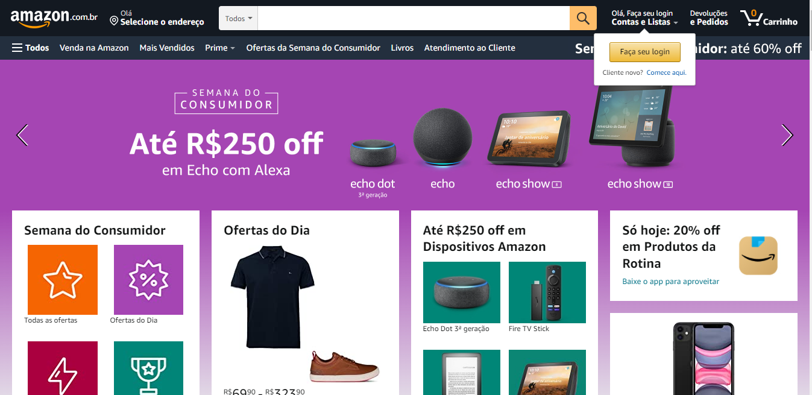

#### Imagem no celular:

### Contraexemplo:

No entanto, o site do Siga não trá tanta flexibilidade para aparelhos móveis, sendo muito pequeno as barras para colocar o login e senha.

#### Imagem no computador:

#### Imagem no celular:
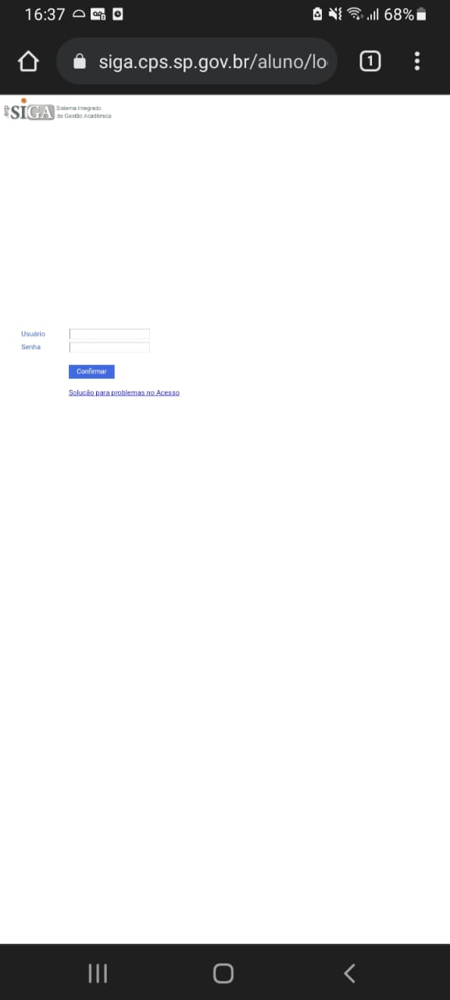

### 1.4 Distinguishable

É importante o usuário conseguir ver e ouvir o conteúdo, além de não ser incomodado com cores que não possuem contraste e áudios reproduzidos sozinhos sem poder serem pausados ou desligados

#### Exemplo:
A maioria dos sites usam um bom contraste de cores. O facebook, por exemplo, usa o azul e o branco em seu site, além da escrita preta para distinguir do fundo branco, que é usado na maioria dos sites (ou ao contrário):

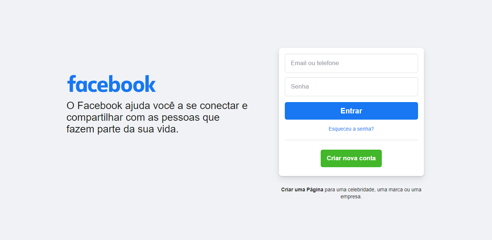

#### Contraexemplo:
Existe um site, por exemplo, chamado Cyber Design Clan que possui muitas cores e dificilmente é distinguível as letras com a cor de fundo:

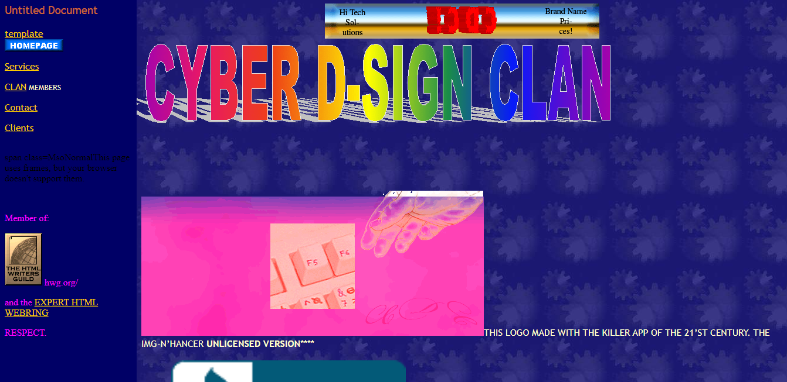

## 2. Operable

### 2.1 Keyboard Acessible

Fazer o usuário conseguir realizar funcionalizades através do teclado é sempre interessante.

#### Exemplo:
Um exemplo de software que utiliza isso é o Word. Ao apertar a tecla alt no programa é apresentado as teclas para mudar para cada aba ou para realizar qualquer funcionalidade possível (mudar fonte do texto, deixar em negrito, mudar alinhamento do texto etc.):

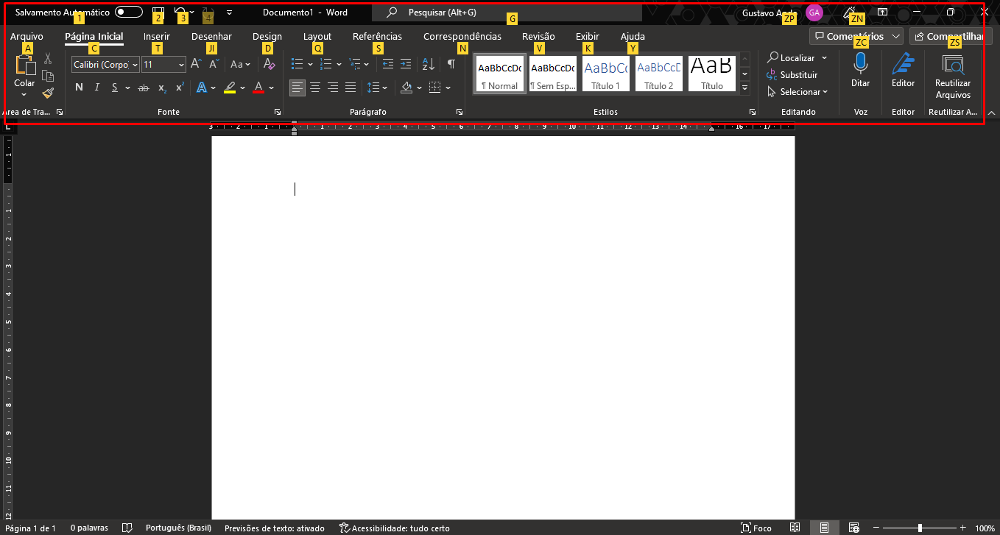

### 2.4 Navigable

Navegar pelo site de forma precisa e fazendo com que o usuário consiga encontrar o que ele precisa, é essencial para sua experiência de uso.

#### Exemplo:
Como exemplo de um site que é possível uma navegação bem interessante é o Wikipedia. Além de separar cada parte do conteúdo em títulos e subtítulos, podemos navegar tranquilamente pelo indíce após a introdução do conteúdo.

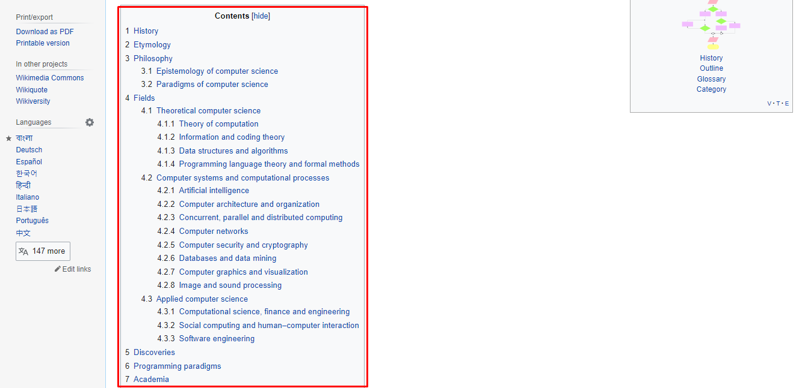

#### Contraexemplo:

## 3. Understable

### 3.1 Readable

O conteúdo deve ser legível e compreensível para qualquer pessoa para melhor experiência.

#### Exemplo:

No site de G1, como ele é de notícias, ou seja, utiliza-se bastante da linguagem verbal, é interessante que seja legível e compreensível seu texto. Nesse caso, ele utiliza letras do tamanho interessante para leitura:

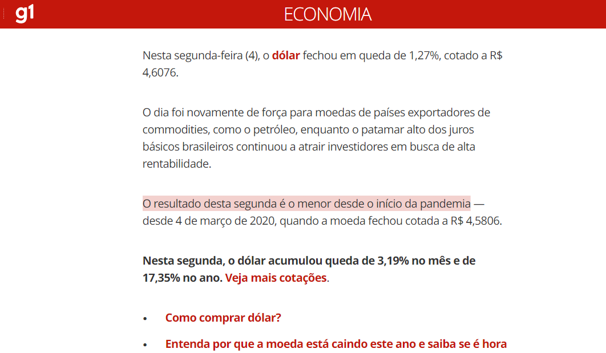

#### Contraexemplo:

As letras utilizadas no site do Siga, no menu e em alguns locais de texto, possui letras muito pequenas, o que dificulta na leitura e para encontrar informações que o usuário precisa:

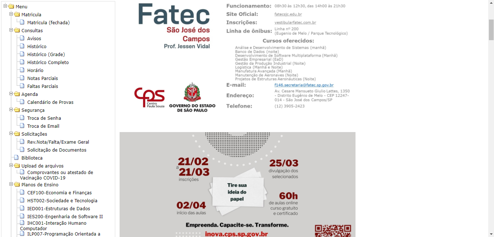

### 3.2 Predictable:

As páginas Webs devem ser intuitivas e previsível pelo usuário.

#### Exemplo:

No site de vídeos Youtube, é fácil para o usuário saber, por exemplo, o que cada opção de reprodução de vídeo faz (pausar, volume, configurações, legendas etc.), se o vídeos está carregando (com um circulo rodando) ou, então, quanto tempo de vídeo já foi carregado (cinza mais claro):

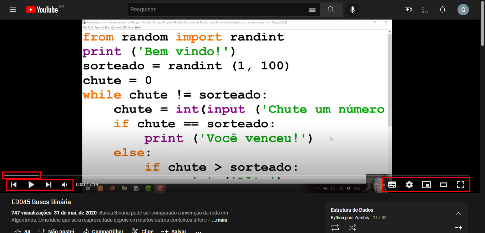

#### Contraexemplo:

### 3.3 Input Assistance

Os usuários precisam de ser ajudados a evitar e a corrigir erros.

#### Exemplo:

Ao tentar logar na sua conta do Google e errar o seu gmail, por exemplo, é exibido uma mensagem de erro no campo e é informado que não foi encontrada:

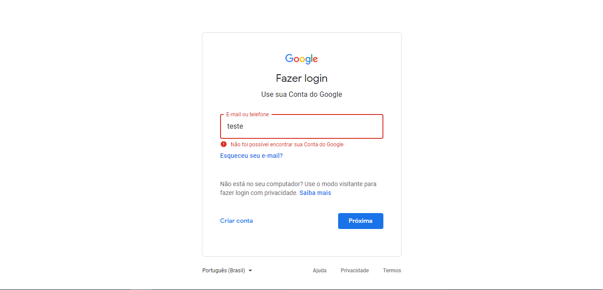
